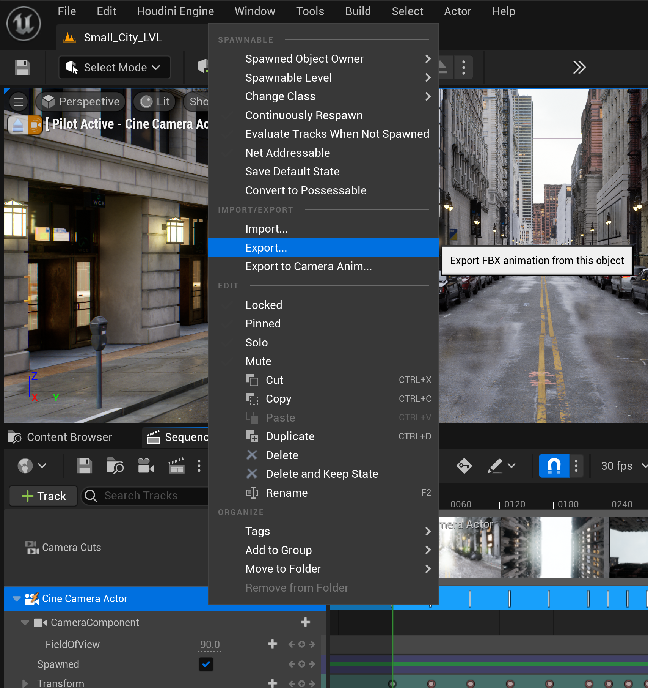
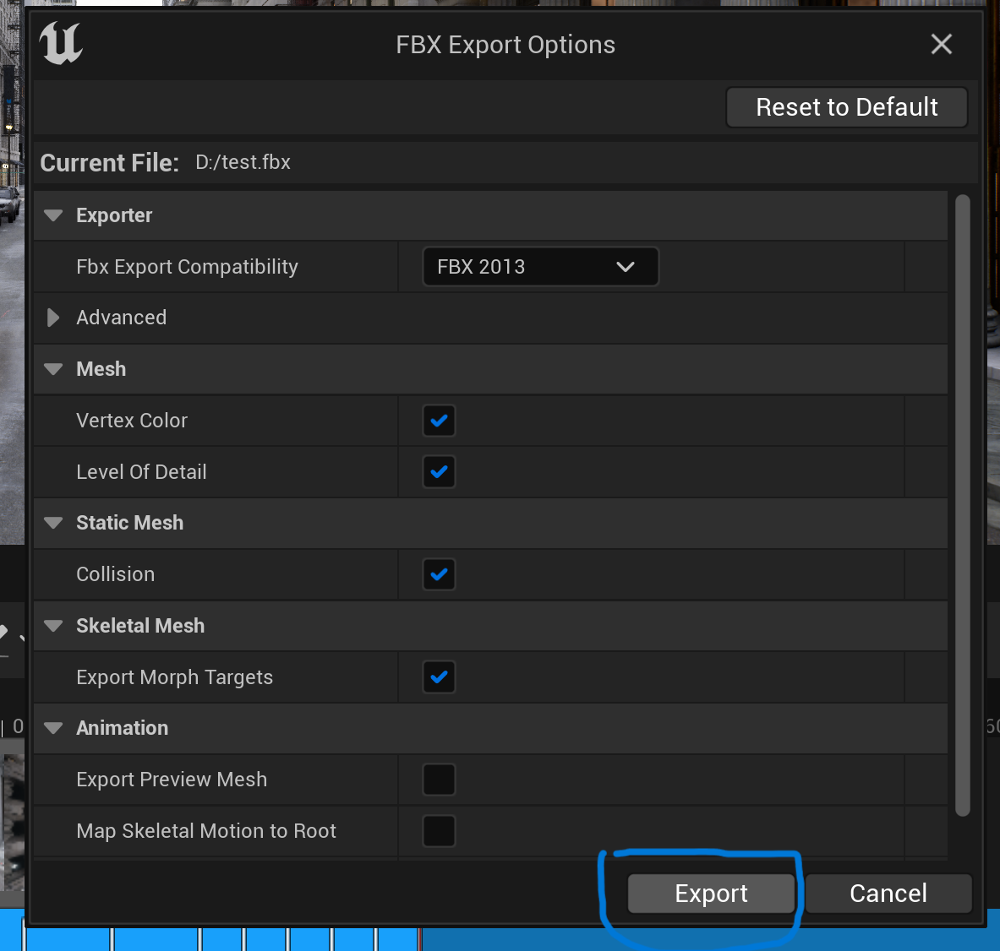
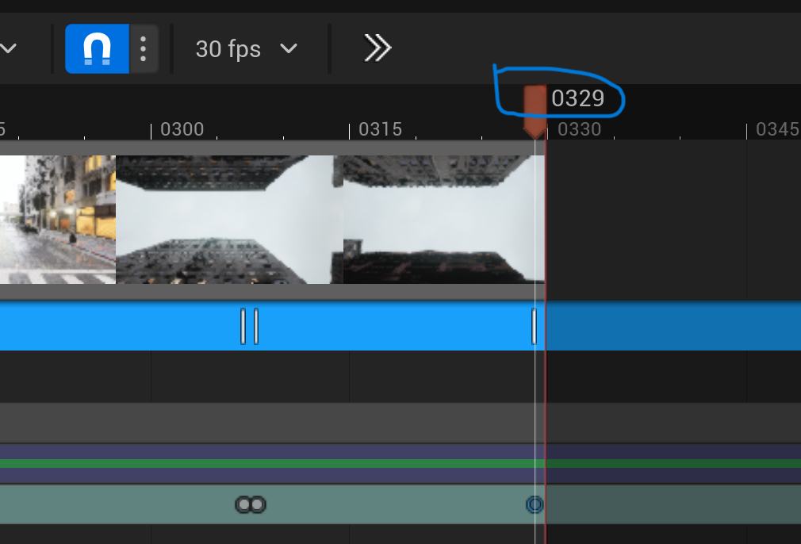
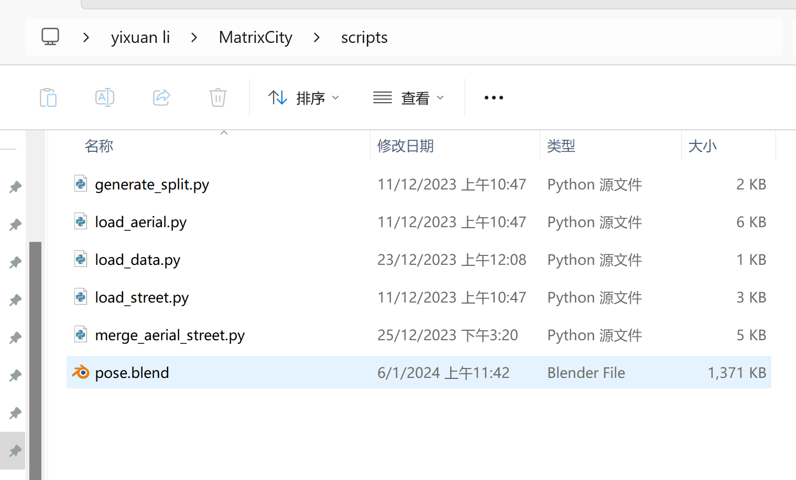
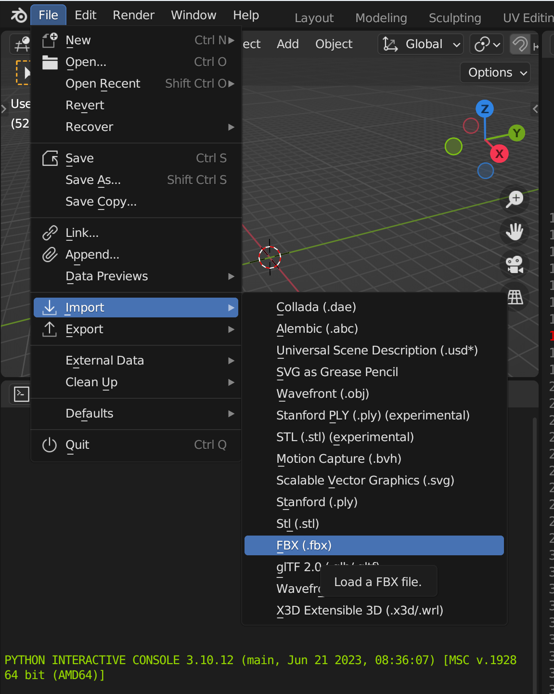
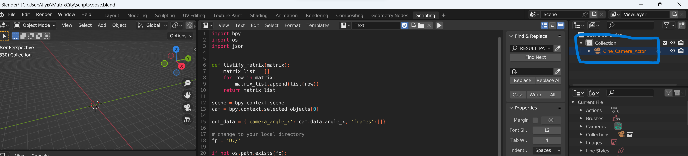
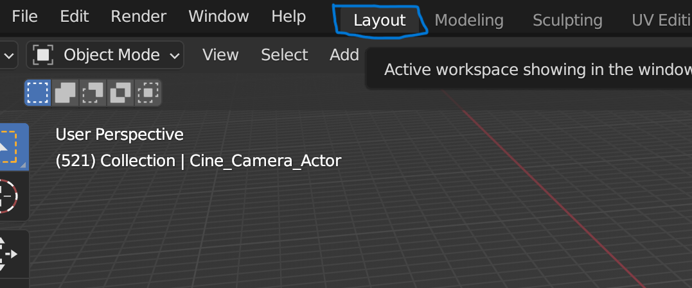
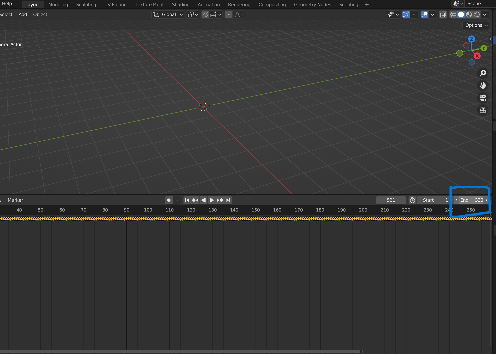
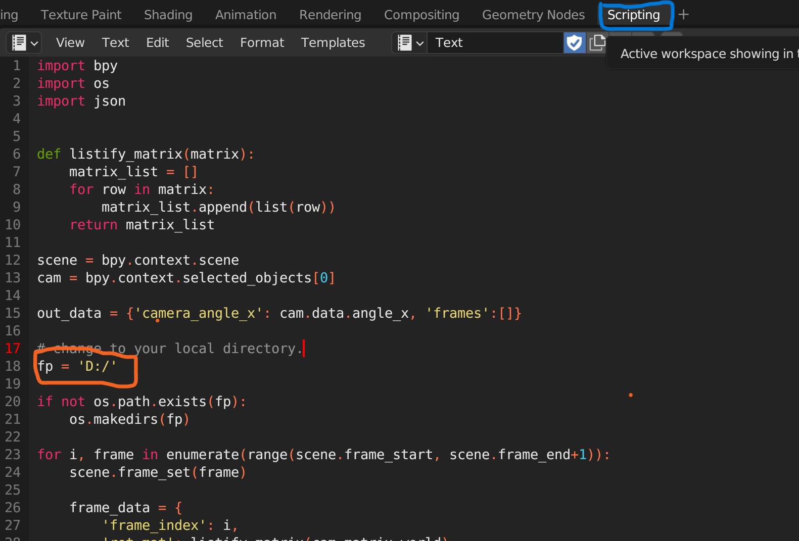
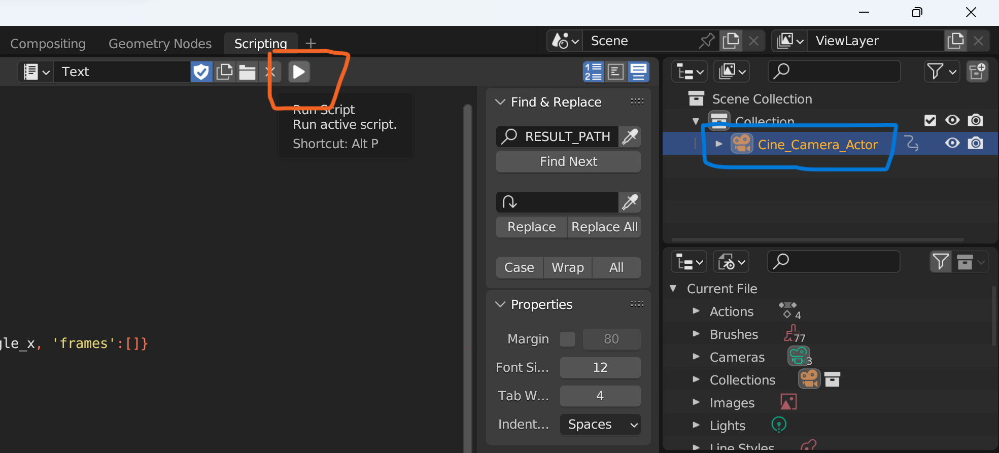

# Export Camera Poses

## 1. Install `Blender`
## 2. Export camera poses from UE project
- Right click on the cine camera actor of the sequence and select `Export...`.

- There is no need to modify the settings, just select `Export`.

- Read the index `N` of the last frame from the sequence or from the rendered image. For the following example, `N` is 329

## 3. Transform camera poses in Blender
- Double-click [pose.blend](../../scripts/pose.blend) to open it in Blender.

- Import the fbx file exported from UE.

- If you import successfully, you will see `Cine_Camera_Actor`.

- Select `Layout` to change the `End` with `N+1` (`N` is the index of the last frame of the sequence).

- Select `Script` and change the `fp` to your local directory.

- Select `Cine_Camera_Actor` and then click the `Run` icon. `transforms.json` will be saved in `fp`. The unit of position is m. And the rotaton matrix needs to be multiplied by 100 to normalize it. You can use [generate_split.py](../../scripts/generate_split.py) to generate files for training. 
