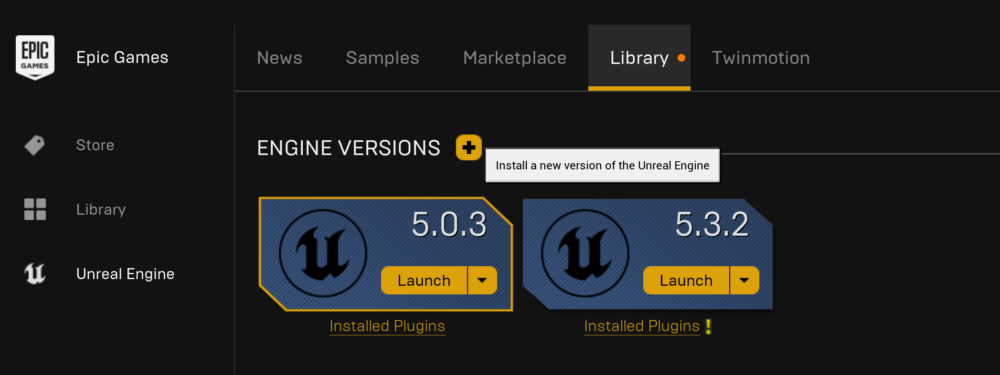
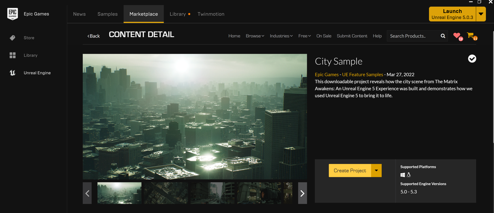
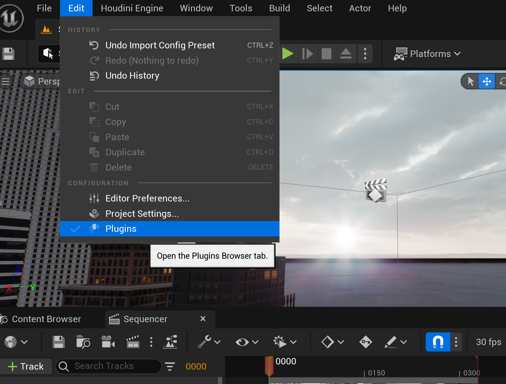
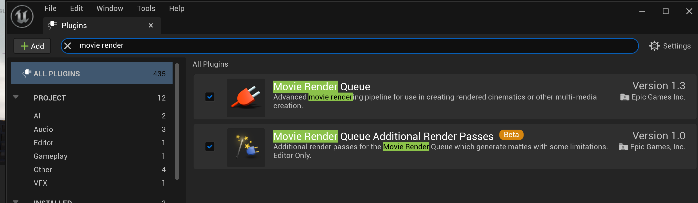
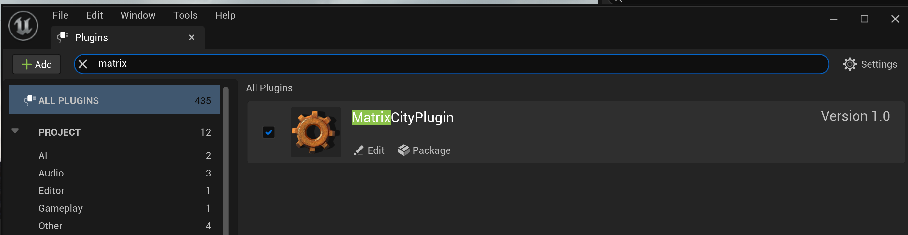
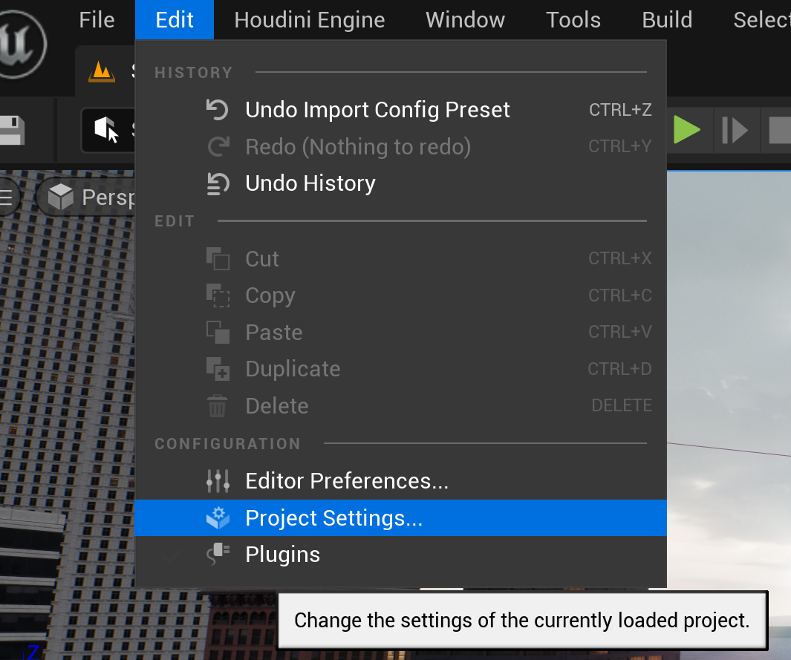
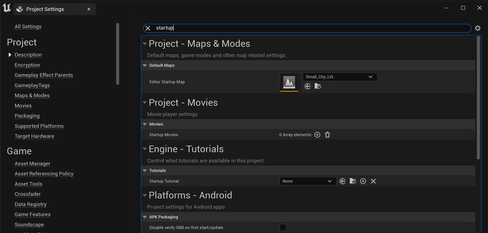

# Get Started

## Device Requirement for `City Sample Project`

- Windows 10 with support for DirectX 12

- 12-core CPU at 3.4 GHz

- 64 GB of System RAM

- GeForce RTX-2080 / AMD Radeon 6000 or higher

- At least 8 GB of VRAM

## Install `Unreal Engine 5.0.3`

- Download and Install [Epic Games Launcher](https://store.epicgames.com/en-US/download).

- Choose `Unreal Engine 5.0.3` and click `Install` in your own setting (normally default setting is good).



## Install `City Sample Project` in Epic Games Launcher

- Install `City Sample Project` in the marketplace of `Unreal Engine`.
- Select the version of `Unreal Engine 5.0`.



## Install `MatrixCityPlugin`

### 0. download the plugin 
Download MatrixCityPlugin from our github repo. And put the `MatrixCityPlugin` folder into the foler `Plugins` of `City Sample Project`, like `CitySample\Plugins\MatrixCityPlugin`.

### 1. set config

Modify config in [misc/user.json](../misc/user.json):

- `ue_command`: refers to the path of `UnrealEditor-Cmd.exe`.
- `ue_project`: refers to the path of your project with suffix of `.uprojcet`.
- `render_config`: refers to the path of render config you defined in `.yaml` 
(an example definition is in [misc/render_config_common.yaml](../misc/render_config_common.yaml)).
- `python_script`: refers to the path of python script you want to execute.

### 2. init the plugin

You can run the command below to install all the dependencies.
```bash
python misc/run_init.py -f misc/user.json
```

This script would execute the following steps:

- `pip install -r misc/requirements_ue.txt` for ue python.

- `pip install -r misc/requirements.txt` for system python.


### 3. setup the `MatriCity` project
>Please take the following steps to ensure that these plugins are enabled.
 



>If you want to use the MatriCityPlugin to generate camera trajectories and render them without manual rendering, you need to modify the project's startup map, same with the level specified in the [utils_sequencer#L866](../Content/Python/utils_sequencer.py).

